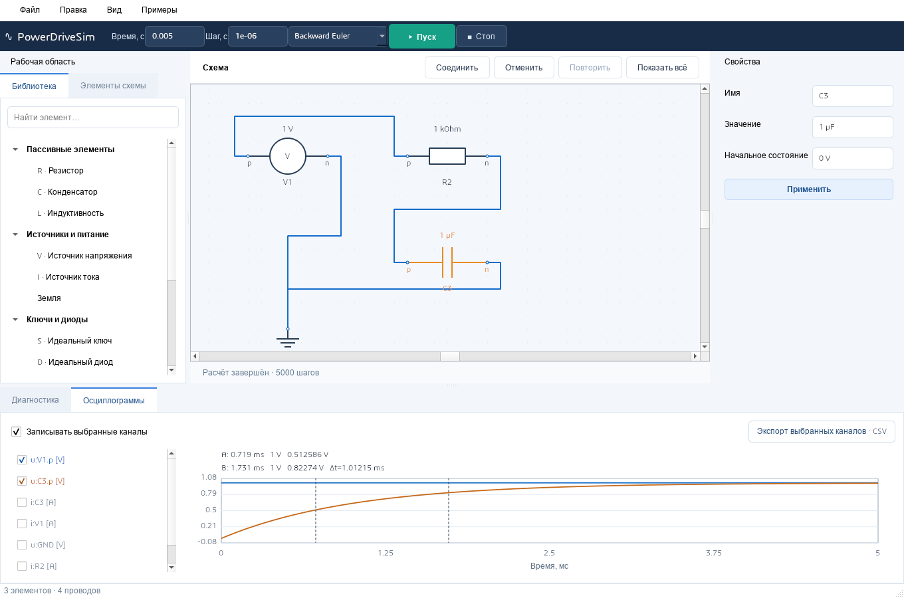
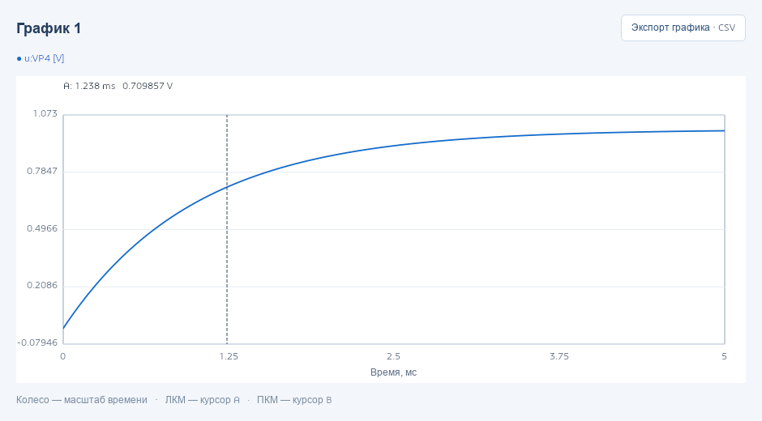
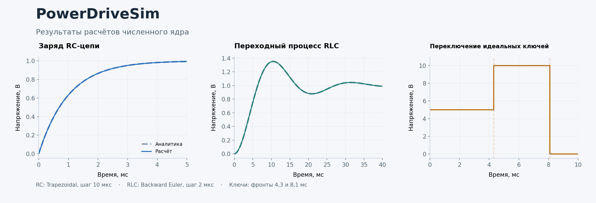

# PowerDriveSim

Настольный симулятор силовой электроники, преобразователей и электроприводов. Электрическую схему можно собрать из отдельных компонентов, задать параметры и переключения, запустить расчёт и посмотреть напряжения и токи прямо в программе.

Проект развивается поэтапно. Работают редактор атомарных и иерархических схем, численное ядро, библиотечные выпрямители и DC/DC, раскрываемые примеры 2L VSI и 3L NPC; дальнейшее расширение библиотеки, электрические машины и ускоренные расчёты находятся в плане разработки.

## Редактор и результаты



*Реальное окно программы. Параметры времени и кнопка «Пуск» находятся сверху, элементы сгруппированы в библиотеке. Для этой RC-цепи вручную включены два канала осциллограмм; по умолчанию запись выключена.*



*Каждый блок «График» открывает отдельное окно с подключёнными сигналами, своими курсорами и экспортом.*

## Что уже работает

- размещение резисторов, конденсаторов, индуктивностей, источников, ключей, диодов и тиристоров на схеме;
- источники напряжения и тока: DC, синусоида, импульсы и таблица;
- соединение портов проводами, перемещение элементов и выделение электрической сети;
- изменение параметров с привычными обозначениями: `1kOhm`, `10µF`; время в секундах, например `10e-3`;
- датчики напряжения и тока, записанные сигналы и постоянный ШИМ с частотой, заполнением и задержкой;
- поворот пробелом, отражение Ctrl+M, копирование, контекстное меню и настройка горячих клавиш;
- вложенные подсхемы с публичными портами, параметрами экземпляров и редактируемыми внутренними элементами;
- расчёт переходных процессов методами Backward Euler и Trapezoidal;
- идеальные и кусочно-линейные ключи и диоды с Ron/Roff/Vf, автоматическое определение состояния диода;
- редактируемые MOSFET/IGBT с отдельными обратными диодами и параметрами канала;
- однофазные и трёхфазные диодные/тиристорные мосты, buck, boost и инвертирующий buck-boost с доступной внутренней схемой;
- тиристоры с удержанием после импульса gate и заданным током выключения;
- опциональное обратное восстановление диода с заданными временами переноса/жизни носителей и начальным зарядом;
- блоки «График» с сигнальными входами и независимыми окнами;
- отключаемые осциллограммы для проверки выбранных точек и проводов;
- запись только подключённых или явно выбранных каналов, масштабирование, два курсора и отдельный экспорт CSV;
- фоновый расчёт с отображением времени и кнопкой остановки;
- сохранение схем, отмена и повтор действий, резервная копия для восстановления;
- русский и английский интерфейс, светлая и тёмная темы.

## Как пользоваться

Дважды щёлкните элемент в библиотеке: на холсте появится полупрозрачный предпросмотр. Щелчком выберите место вставки. Для соединения зажмите вывод и протяните провод к другому выводу или любой точке провода. Выделите элемент, задайте его параметры справа и нажмите **«Применить»**.

Добавьте **«График»** с верхней панели компонентов и соедините его входы с электрическими выводами, проводами, выходами датчиков или управляющими сигналами. Укажите время и шаг сверху, нажмите **«Пуск»**, затем откройте график двойным щелчком.

Прямое подключение графика измеряет напряжение точки относительно земли без нагрузки на схему. Для напряжения между двумя точками используйте датчик напряжения.

Для разовой проверки выберите **«Наблюдать точку / сигнал»** в контекстном меню провода. Во вкладке **«Осциллограммы»** отмечаются каналы для следующего пуска. Когда запись выключена, история осциллограмм не создаётся. Экспорт CSV находится у соответствующего графика и сохраняет только его каналы.

Готовые схемы доступны в меню **«Примеры»**. [Краткое руководство по редактору](docs/desktop.md) описывает соединения, события ключей и восстановление схем.

## Проверенные примеры



*Результаты численного ядра. RC и RLC сравниваются с аналитическими решениями; справа показано переключение нагрузки между источниками питания.*

- [Заряд RC-цепи](examples/rc.pds) и [вариант с Trapezoidal](examples/rc-trapezoidal.pds).
- RC с [синусоидой](examples/rc-sine.pds), [импульсами](examples/rc-pulse.pds) и [табличным источником](examples/rc-table.pds).
- [Колебательный переходный процесс RLC](examples/rlc.pds).
- [Переключение идеальных ключей](examples/switch.pds).
- [Свободный ход индуктивной нагрузки через диод](examples/diode-freewheel.pds).
- [Трёхфазный 2L VSI](examples/vsi-2l.pds) и [3L NPC](examples/npc-3l.pds) с RL-нагрузками и отдельными снабберами ключей.

Параметры и ожидаемые результаты приведены в [описании примеров](examples/README.md).

## Особенности проекта

**Схема состоит из отдельных элементов.** Соединения и параметры доступны для изменения, а расчёт выполняется общим решателем для поддерживаемых компонентов.

**Физическая модель остаётся явной.** Скрытые стабилизаторы не добавляются. Ошибки соединений и вырожденные системы выводятся в панели диагностики.

**Управление отделено от силовой части.** Ключи принимают готовые управляющие сигналы. Будущий Controller с АЦП и выполнением алгоритмов относится к отдельному этапу.

## Установка и запуск

Пока доступна сборка из исходников. Нужны CMake 3.20+, компилятор C++20 и Qt 6.5+ с Widgets и Concurrent.

```sh
cmake -S . -B build -DPDS_BUILD_DESKTOP=ON -DCMAKE_PREFIX_PATH="путь/к/Qt"
cmake --build build --config Release
```

В Windows приложение находится в `build/Release/powerdrive-desktop.exe`, в Linux — в `build/powerdrive-desktop`. Для запуска Windows-сборки рядом с приложением нужно разместить библиотеки Qt; [команды сборки и запуска](docs/desktop.md#сборка-и-запуск) приведены отдельно.

Установщик ещё не выпущен. Запуск без графического интерфейса также поддерживается.

## Дальнейшее развитие

Ближайшие задачи — расширение диагностики топологии и проверка больших схем. Далее запланированы библиотека преобразователей, электрические машины, механические нагрузки и ускорение расчётов.

## Документация

- [Полное техническое задание](docs/specifications/PowerDriveSim_Technical_Specification_RU.md)
- [Правила разработки](docs/specifications/PowerDriveSim_Codex_Instructions_RU.md)
- [Текущее состояние и следующие задачи](AGENTS.md)
- [Проверка редактора](docs/verification-m1-desktop.md)
- [Проверка методов интегрирования и диодов](docs/verification-m1-core.md)
- [Архитектура](docs/architecture.md) и [формат проекта](docs/project-format.md)
